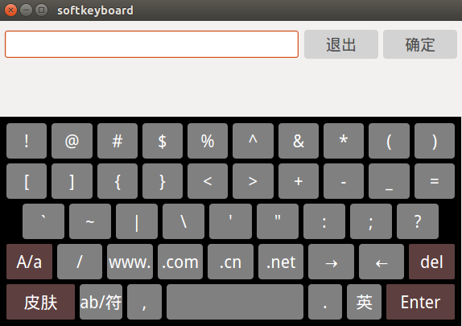
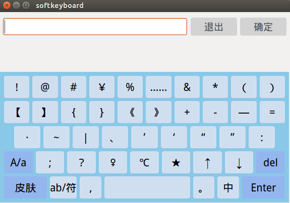
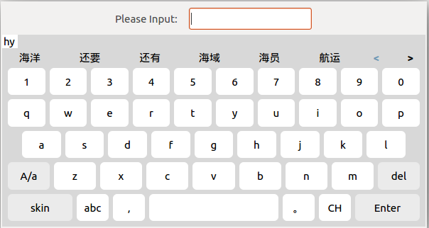
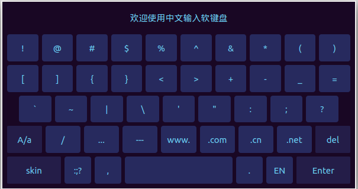

# softkeyboard
这是一个基于Qt widget的软键盘小项目，支持中文输入，以及常用词组输入。(项目配有中文拼音字典文件ChinesePinyin，可手动添加特定环境下的词汇）
## 中文输入原理：
使用普通文本格式的文件存放拼音字典，初始化时读取拼音字典文件，将对应的汉语拼音与汉字以键值对形式插入到哈希表中。哈希表支持一键多值，可以实现同音不同字的特点，此外哈希表有着非常高的读取效率，以实现输入时的快速匹配，而不会卡顿。  
拼音字典中存放着常用的汉字和词组，为了实现首字母匹配词组(例：爱情ai'qing输入aq，aiq，aiqing均可匹配出爱情)，初始化哈希表时会对字典中词组的拼音进行拆解处理，将词组所有匹配的拼音都保存到哈希表中。当然由于拼音字典键值对较多，接近两万行，加上对词组的拆解处理相对比较费时，在主频500MHz的arm开发板上完成一次哈希表的完全插入需要大约1.5s，勉强可以接受。  
## 版本控制
### V1.0.*:
+ **版本概述**  
	该该版本将整个软键盘界面封装到了一个类中，使用时直接创建对象即可。整个界面主要分为三个区域（输入缓存区、中文显示区、键盘按键区），输入的内容临时放在输入缓存区，以信号的形式向外发送。  
	键盘的按键包含所有的数字及大小写字母，以及常用的中英文字符。目前提供了三套皮肤，仅仅做了颜色上的变换。中文输入时会单独弹出一个显示区域，包括拼音以及对应候选词。总之键盘的布局样式还能看，功能上基本能应付普通的输入，所有到此暂时结项，以后有时间再升级优化。  
+ **运行截图**  

### V2.0：
+ **版本概述**  
	该版本在V1.0.\*的基础上做了部分修改，主要调整了软键盘的布局结构和显示样式.  
	+ **布局结构：**  
	整个界面依然由三个区域组成（输入缓存区、功能及中文候选区、键盘按键区），但输入缓存区默认是不显示的，键盘输入的内容可以直接放到指定的编辑框中,不再需要通过信号传递输入的文本。当然也可以选择显示输入缓存区，将输入内容临时存放，然后通过信号传递给指定的文本框，适用于软键盘全屏展示或原始输入框被遮挡的情况。  
    功能及中文候选区就是原来的中文显示区，不再采取原来弹出的形式（会影响按键区的布局），而是和下面的按键区绑定在一起，非中文输入时显示功能区(目前还未添加功能接口)，中文输入时显示候选区(包括候选词和英文字母)。  
    按键区结构及内容未做调整。  
    关于布局结构考虑了很久，但最终还是没能满足去应对嵌入式界面的各种特点，只能后期根据实际需求再改。代码中还有需要优化的地方，但接下来要开新项目没什么时间了，所以先保存一版，以后再改。
    + **显示样式:**  
	之前的三套皮肤颜色搭配是自己一点点试出来的，程序员向来做不了设计师的活，直男审美，越看越丑。这次参考了网上的一些输入法键盘的颜色搭配，重新调整了皮肤样式，感觉比之前好了些。  
+ **运行截图**  

## 作者联系方式:
**邮箱:justdoit_mqr@163.com**  
**新浪微博:@为-何-而来**  